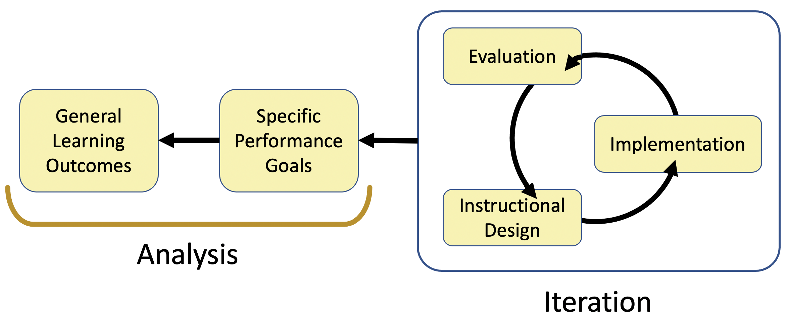

```{r, child="_setup.Rmd"}
```
#### \   

The case design and teaching resources on this site are organized around a modified ADDIE model of curriculum design (U. Florida, 1975), with elements of backwards design (Wiggins & McTighe, 1999). The two instructional design models share many features. More faculty are familiar with backwards design, while instructional designers tend to favor ADDIE. 

The five steps of the ADDIE Model are:

1. __A__ nalyze
2. __D__ esign
3. __D__ evelop
4. __I__ mplement
5. __E__ valuate

The first step in ADDIE (and backwards design) is to analyze the learning situation, and establish general learning outcomes and performance benchmarks. Analysis corresponds to the initial linear phase of backwards design.



<center>
_ADDIE model of instructional design, mapped onto backwards design workflow._
</center><br>

Next comes the design and development phase. Typically we move back and forth between these two steps many times prior to implementation, so for simplicity I combined them into one step. This better fits the backwards design model as well, where design is part of the cyclic phase.

The next steps in ADDIE are implementation (corresponding to backwards design's learning plan) and evaluation (corresponding to evidence and assessment).

The above figure shows a one-way iteration cycle moving from design to implementation to evaluation. In practice we often move back and forth between these three elements in both directions. For example, we might use results of an evaluation to adjust how we implement an instructional technique without going back and reconsidering the design of the course as a whole.

#### \   

# Goals of Analysis

The first step in the ADDIE process is to determine what specific goals you hope to accomplish in a course. More specifically:

1. __What are the general learning outcomes?__ What principles, theories, concepts, skills, or content knowledge should students achieve as a result of learning activities?
2. __What are appropriate specific benchmarks or performance goals?__ What will students be able to do to indicate they have accomplished these endpoints?
3. __How should the goals be sequenced?__ Which benchmarks do students need to reach first, before they can achieve others?

#### \   

# Goals for Design and Development

The second step in the ADDIE process is to determine how best to help students achieve the specific goals established in the __Analysis__ stage. In practice, design and development shifts to revision and refinement as a case or course matures. 

Specific questions to ask in the Design and Development phase are:

1. What activities, scenarios, or problems will allow or best help students reach the benchmarks?  
2. How will the learning activities from #1 be incorporated into a general case format?
3. What additional information or resources will students or the instructor need for the case?

#### \   

# Goals for Implementation

This stage of the ADDIE process is similar to Design and Development in that there will always be some ongoing redesign as the studen population changes, course goals change, or other course elements become more or less important. 

Specific questions to ask related to implementation include:

1. How will the case and related materials be delivered?
2. How will students complete and submit case work and assessments?
3. How will the instructor provide support for the case in progress? Adjust or modify the case? Guide students through the process?

#### \   

# Goals for Evaluation

The final step in the ADDIE process is to determine whether your students have achieved the specific goals established in the __Analysis__ stage. In practice, evaluation is an ongoing process. At some point though, you as the instructor need to compile the data collected and decide which learning outcomes students are meeting adequately vs. which outcomes they are not meeting. The answer to the latter question will inform the process of revision, which goes back to the design and develop phase of the process.

Specific questions to ask include:

1. What questions did I come up with based on the analysis stage? Does the evaluation process provide sufficient data to answer those questions with confidence?
2. Are students reaching the end goals of the course overall? That were set in the design and development phase?
3. Is the implementation process working as expected? Where are students getting confused or off track? Are they able to self-correct? 

#### \   

<hr>